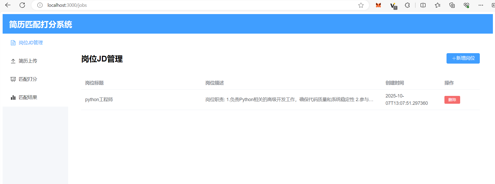
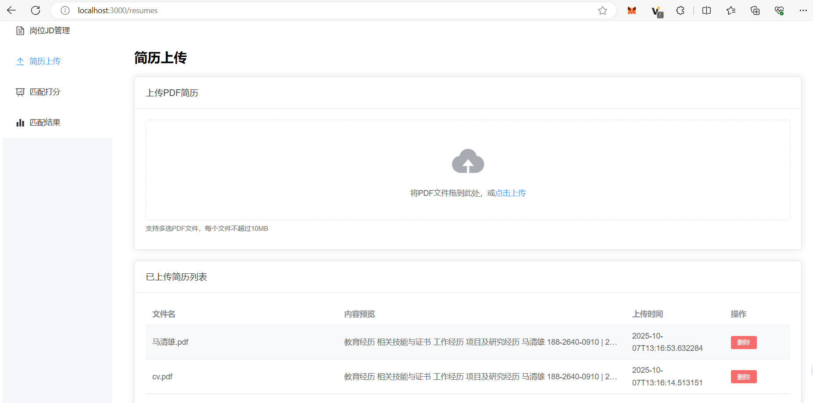
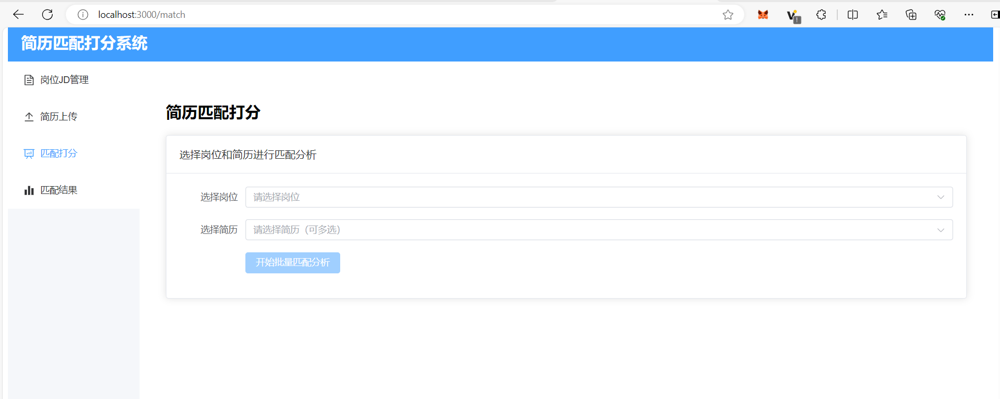
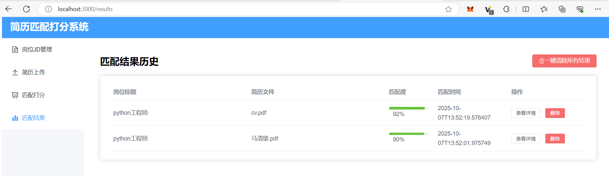
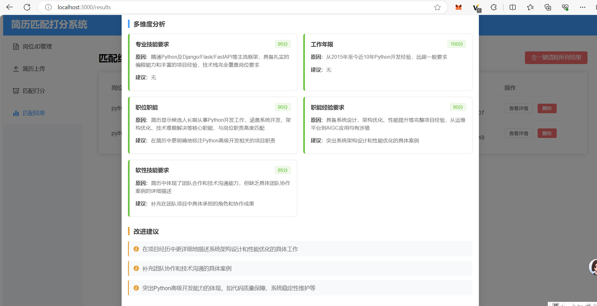

# 简历匹配打分系统

一个基于Vue.js前端和Flask后端的智能简历匹配打分系统，使用DeepSeek AI API进行智能分析。

## 功能特性

- ✅ 岗位JD设置界面（字符串入库）
- ✅ PDF简历上传界面（解析简历字符串入库）
- ✅ 岗位JD和简历匹配打分界面
- ✅ 智能AI分析匹配度
- ✅ 多维度评分和详细分析
- ✅ 匹配结果历史记录

## 预览






## 技术栈

### 前端
- Vue.js 3.x
- Element Plus UI组件库
- Vite构建工具
- Axios HTTP客户端

### 后端
- Flask框架
- SQLAlchemy ORM
- SQLite数据库
- PyPDF2 PDF解析

### AI服务
- DeepSeek API（智能匹配分析）

## 安装和运行

### 1. 克隆项目
```bash
git clone <repository-url>
cd jianli
```

### 2. 后端环境配置
```bash
# 安装Python依赖
pip install -r requirements.txt

# 配置DeepSeek API密钥
# 编辑 .env 文件，将 your_deepseek_api_key_here 替换为您的实际API密钥
```

### 3. 前端环境配置
```bash
# 进入前端目录
cd frontend

# 安装Node.js依赖
npm install

# 构建前端（可选）
npm run build
```

### 4. 启动系统

#### 方式一：分别启动前后端
```bash
# 终端1：启动后端（在项目根目录）
cd backend
python app.py

# 终端2：启动前端（在项目根目录）
cd frontend
npm run dev
```

#### 方式二：使用启动脚本（推荐）
```bash
# Windows系统
start_backend.bat
start_frontend.bat

# 或者使用PowerShell
.\start_backend.ps1
.\start_frontend.ps1
```

### 5. 访问系统
- 前端地址：http://localhost:3000
- 后端API：http://localhost:5000

## 使用说明

### 1. 设置岗位JD
- 进入"岗位JD管理"页面
- 点击"新增岗位"按钮
- 填写岗位标题和详细描述
- 保存后岗位信息将存入数据库

### 2. 上传简历
- 进入"简历上传"页面
- 拖拽或点击上传PDF格式的简历文件
- 系统自动解析简历内容并存储

### 3. 匹配打分
- 进入"匹配打分"页面
- 选择要分析的岗位和简历
- 点击"开始匹配分析"
- 系统调用DeepSeek API进行智能分析
- 查看详细的匹配度评分和改进建议

### 4. 查看历史
- 进入"匹配结果"页面
- 查看所有历史匹配记录
- 点击"查看详情"查看完整分析结果

## API密钥配置

1. 获取DeepSeek API密钥：访问 https://platform.deepseek.com/
2. 编辑 `.env` 文件：
```env
DEEPSEEK_API_KEY=您的实际API密钥
FLASK_ENV=development
FLASK_DEBUG=True
```

## 项目结构

```
jianli/
├── backend/                 # 后端代码
│   ├── app.py              # Flask主应用
│   └── services/           # 服务层
│       ├── deepseek_service.py  # DeepSeek API服务
│       └── pdf_parser.py        # PDF解析服务
├── frontend/               # 前端代码
│   ├── src/
│   │   ├── views/          # 页面组件
│   │   ├── api/            # API服务
│   │   └── router/         # 路由配置
│   ├── package.json
│   └── vite.config.js
├── database/               # SQLite数据库文件
├── .env                    # 环境配置
├── requirements.txt        # Python依赖
└── README.md              # 说明文档
```

## 注意事项

1. **API密钥**：请务必配置有效的DeepSeek API密钥
2. **文件大小**：PDF文件大小限制为10MB
3. **网络要求**：系统需要访问DeepSeek API，请确保网络连接正常
4. **浏览器兼容**：建议使用Chrome、Firefox等现代浏览器

## 故障排除

### 后端启动失败
- 检查Python版本（需要Python 3.7+）
- 确认所有依赖已安装：`pip install -r requirements.txt`
- 检查端口5000是否被占用

### 前端启动失败
- 检查Node.js版本（需要Node.js 14+）
- 确认依赖已安装：`npm install`
- 检查端口3000是否被占用

### AI分析失败
- 检查API密钥配置是否正确
- 确认网络连接正常
- 查看控制台错误信息

## 开发说明

### 添加新的匹配维度
编辑 `backend/services/deepseek_service.py` 中的提示词模板，添加新的分析维度。

### 自定义UI样式
前端使用Element Plus组件库，可以修改 `frontend/src/views` 中的组件样式。

### 扩展数据库模型
在 `backend/app.py` 中修改或添加新的数据库模型类。

## 许可证

MIT License